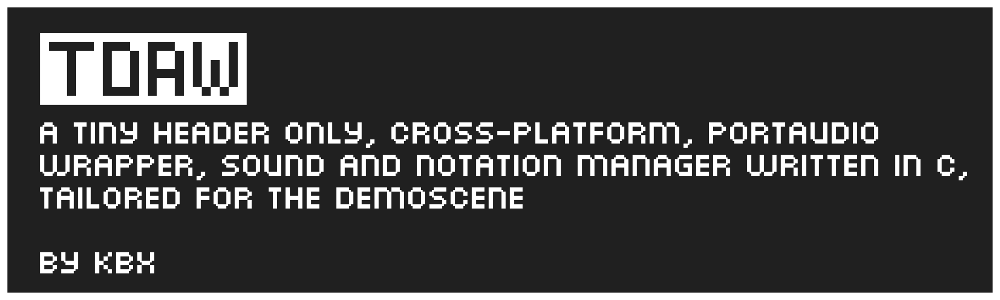

# TDAW

A tiny, header only, easy to use, cross-platform, portaudio wrapper, sound and notation manager, tailored for the demo scene.

This header enables you to do shader-like sound programming (similar to that of [ShaderToy](https://shadertoy.com "ShaderToy")) inside of C/C++ incredibly easy. It also comes with various ease-of-use functions such as BPM calculations and notation management.

Currently the sine wave demo on Linux compiles to 1.8kb (Arch Linux, 1889 bytes, demo/linux)

<p align="center">

</p>

# Usage

Before including TDAW, you must first `#define TDAW_IMPLEMENTATION` in *one* C/C++ file.

There are various features you can activate by defining the following lines:

```c
#define TDAW_IMPLEMENTATION // Implements TDAW
#define TDAW_NOTATION // Access notation management
#define TDAW_USERDATA // Allow user data to be passed to your stream
#define TDAW_BPM // Access BPM calculation functions.
#define TDAW_PESYNTH // Access basic example synthesizers.
#define TDAW_DEBUGTEXT // Output debug text to console
#define TDAW_DEBUGIMGUI // Create ImGui Windows for debugging (C++ only)
```
These are also detailed in the header itself.

Next create a `TDAW_PASSDATA` instance like so:
```c
TDAW_PASSDATA data;
```
From here you can put the pointer to your music code like so:
```c
data.ptr = &music;
```
And any userdata can be passed through `data.userData` (make sure `TDAW_USERDATA` is defined!)

Next you must initialise TDAW and open a stream for the sound to begin playing:
```c
TDAW_PIP tdaw = TDAW_initTDAW(44100, 1400); //sample rate, frames per buffer
TDAW_openStream(&tdawm &dat);
```
To close a stream, run `TDAW_closeStream()` and to terminate a TDAW instance run `TDAW_terminate`.

Documentation will come soon. For now poke around in the demo/examples folder.

# Dependencies
- PortAudio
